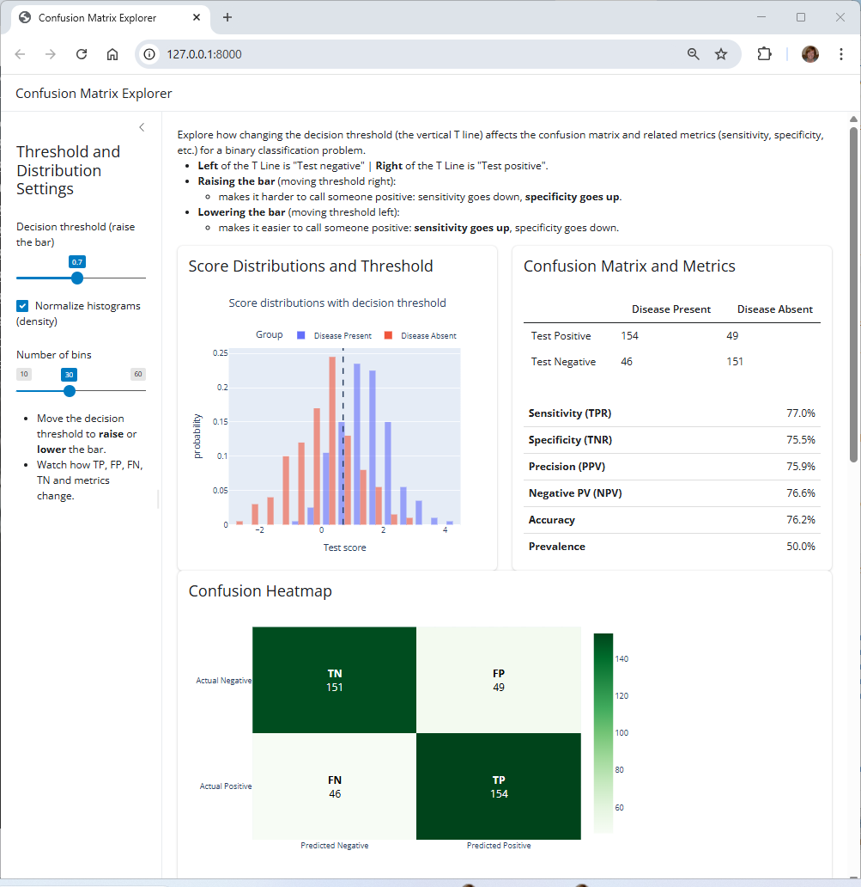
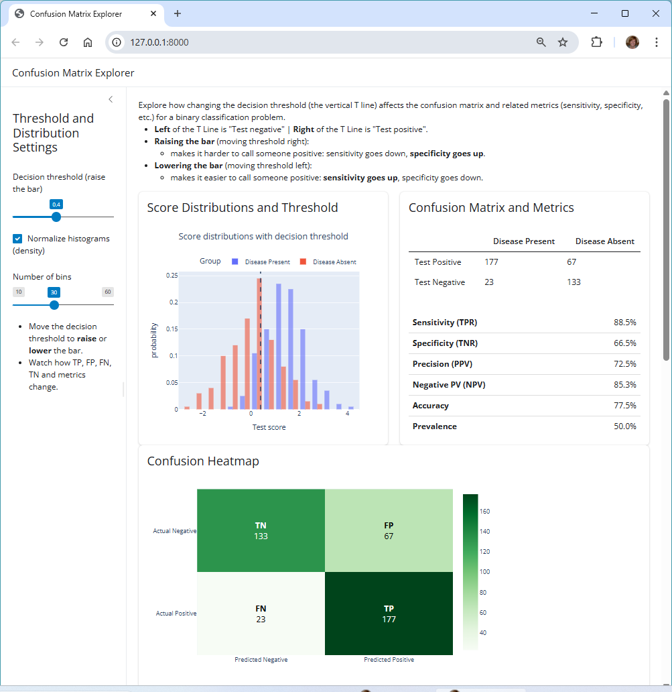

# Confusion Matrix Explorer (PyShiny App)

[](https://denisecase.github.io/confusion-matrix-explorer/)
[](https://github.com/denisecase/confusion-matrix-explorer/actions/workflows/ci.yml)
[](LICENSE)
[](https://www.python.org/)


> This repo (`confusion-matrix-explorer`) contains a PyShiny app for exploring how changing a decision threshold affects a binary classifier confusion matrix and related metrics (sensitivity, specificity, precision, etc.).

## Prerequisites: Set Up Machine

- View hidden files and folders
- View file extensions
- Git
- VS Code (recommended)
- **[uv](https://github.com/astral-sh/uv)**

## Fork and Clone Repository

1. Fork the repo.
2. Clone your repo to your machine and open it in VS Code.

Open a terminal and run the following commands.

```shell
git clone https://github.com/YOUR_USERNAME/confusion-matrix-explorer.git
cd confusion-matrix-explorer
```

## 1. Set Up and Run

- Open the repo directory in VS Code.
- Open a terminal in VS Code.

```shell
uv python pin 3.12
uv venv

.venv\Scripts\activate # Windows
# source .venv/bin/activate  # Mac/Linux/WSL

uv sync --extra dev --extra docs --upgrade
uv run pre-commit install
uv run pytest -q
uv run shiny run --reload src/confusion_matrix_explorer/app.py
```

Open browser to link provided in the terminal (or use CTRL+click to open). 
Link is <http://127.0.0.1:8000> by default. Press CTRL+C to quit

## About the App

This app demonstrates how changing the decision threshold (the vertical T line) affects the confusion matrix and related metrics (sensitivity, specificity, etc.) for a binary classification problem.

How to Use

- Use the sidebar upper slider to vary the decision threshold.
- Use the sidebar lower slider to vary the number of bins in the histogram.
- Compare the as you raise (or lower) the decision threshold.

---

## Screenshot (Raise the Bar)


## Screenshot (Default)



## Screenshot (Lower the Bar)



## License

This project is licensed under the [MIT License](LICENSE).
